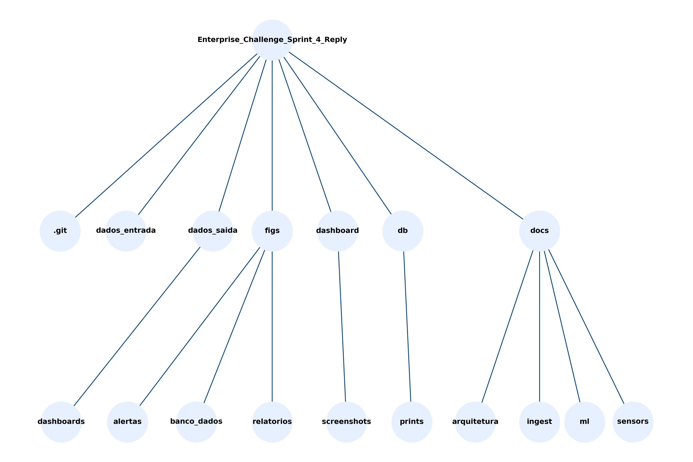

### FIAP - Faculdade de Informática e Administração Paulista

🌐 Fase 6 - Colheita de soluções inteligentes - transformando dados em ações  /  Sprint 4 — Enterprise Challenge FIAP / Hermes Reply

Equipe 

- **Carlos** - RM566487
- **Endrew** - RM563646
- **João** - RM565999
- **Tayná** - RM562491
- **Vinicius** - RM566269

---

Descrição do Projeto

O **HERMIA** é um MVP de **Indústria 4.0** que integra:
- **Sensores IoT (ESP32)** em modo real ou simulado,
- **Ingestão** de dados em CSV,
- **Banco relacional (SQLite)**,
- **Machine Learning** (treino/inferência),
- **Dashboard (Streamlit)** com KPIs, gráficos e **alertas** com log de evidências.

O objetivo é demonstrar um **pipeline ponta a ponta**: coleta → ingestão → persistência → análise → visualização/alertas, com foco em **observabilidade e reprodutibilidade**.

---


📂 Estrutura do Repositório




- [`/sensors`](./sensors) → Código para ESP32 (modo simulado e real), configuração no PlatformIO/Wokwi e saída dos sensores.  
- [`/ingest`](./ingest) → Dados simulados de entrada (CSV) para popular o pipeline.  
- [`/db`](./db) → Scripts SQL para criação do esquema (schema.sql) e consultas (queries.sql).  
- [`/ml`](./ml) → Treinamento e execução de modelos de Machine Learning.  
- [`/dashboard`](./dashboard) → Aplicação Streamlit para visualização de métricas e alertas, com evidências em `/dashboard/screenshots`.  
- [`/docs/arquitetura`](./docs/arquitetura) → Diagramas e documentação do sistema.  

---


## Fluxo de Dados (ponta a ponta)

1. **Sensores / Simulação**  
   O ESP32 (em modo real ou simulado) gera leituras de temperatura, vibração, luminosidade e qualidade do ar.  
   Os dados são exportados para `saida_sensor.csv`.

2. **Ingestão**  
   A partir de `saida_sensor.csv`, é construído o `readings.csv` que alimenta a camada de ingestão.

3. **Persistência em Banco**  
   O arquivo `readings.csv` é importado para as tabelas do banco (via `schema.sql`).  
   A tabela `alerts` armazena sinais disparados pelo dashboard.

4. **Machine Learning**  
   Sobre os dados armazenados, treina-se um modelo simples que permite realizar previsões ou classificações (exibir métricas como MAE).  

5. **Dashboard & Alertas**  
   O app Streamlit exibe KPIs, séries temporais e dispara alertas baseados em regras configuráveis.  
   Todo alerta é registrado para auditoria.

6. **Documentação / Evidências**  
   O diagrama da arquitetura e screenshots das interfaces servem como comprovação do funcionamento e desenho do pipeline.

---

## 🗄️ Como o Banco de Dados foi Modelado

O banco de dados foi projetado para garantir a **integridade dos dados coletados pelos sensores**, registrar **alertas de falhas** e manter um **histórico de manutenção** das máquinas monitoradas. O modelo segue princípios de normalização e respeita as regras de integridade e restrições definidas.


---

### Estrutura Geral das Tabelas

- **Tabela `MAQUINA_AUTONOMA`**
  - Armazena informações das máquinas monitoradas.
  - **Chave primária:** `ID_MAQUINA`
  - **Restrições:** `NOT NULL` em campos essenciais; `CHECK (Tipo IN ('Solda','Corte','Montagem','Pintura'))` garante apenas tipos válidos de máquina.
  


- **Tabela `LEITURA_SENSORES`**
  - Centraliza as leituras enviadas pelos sensores (temperatura, vibração, luminosidade, qualidade do ar, etc.).
  - **Chave primária:** `ID_LEITURA_SENSORES`
  - **Chave estrangeira:** `ID_MAQUINA` → `MAQUINA_AUTONOMA` (garante que cada leitura pertença a uma máquina existente).
  - **Restrições:** 
    - `NOT NULL` evita dados ausentes.
    - `CHECK` define intervalos plausíveis:
      - `TEMPERATURA`: -50 a 150 °C  
      - `UMIDADE`: 0 a 100 %  
      - `FALHA`: 0 ou 1  
      - `LUMINOSIDADE`: 0 a 1000 lux  
      - `VIBRACAO`: 0 a 100  
      - `QUALIDADE_AR`: 0 a 500  
      - `DIAS_ULTIMA_MANUTENCAO`: 0 a 37000  


- **Tabela `FUNCIONARIO`**
  - Registra os responsáveis por manutenção.
  - **Chave primária:** `ID_FUNCIONARIO`
  - **Restrições:**
    - `NOT NULL` em todas as colunas.
    - `CHECK (Salario >= 1518)` assegura que salários sejam acima do mínimo.
    


- **Tabela `MANUTENCAO`**
  - Registra eventos de manutenção preventiva ou corretiva.
  - **Chave primária:** `ID_MANUTENCAO`
  - **Chaves estrangeiras:**
    - `ID_FUNCIONARIO` → `FUNCIONARIO`
    - `ID_MAQUINA` → `MAQUINA_AUTONOMA`
  - **Restrições:** `NOT NULL` em todos os campos.
  
  


- **Tabela `ALERTS` (complementar ao dashboard)**
  - Mantém o log de alertas disparados pelas regras de negócio do sistema.
  - **Colunas principais:**
    - `ts` (timestamp do alerta)  
    - `device_id` (máquina associada)  
    - `regra` (condição disparada, ex.: `vib≥0.8`)  
    - `valor` (valor medido no momento)  
    - `severidade` (baixa, média ou alta)  
    - `status` (registrado, tratado, etc.)  

---

### Relacionamentos Principais

- **1:N entre `MAQUINA_AUTONOMA` e `LEITURA_SENSORES`**  
  Cada máquina pode ter milhares de leituras ao longo do tempo.  
  


- **1:N entre `MAQUINA_AUTONOMA` e `MANUTENCAO`**  
  Uma máquina pode passar por várias manutenções.  

- **1:N entre `FUNCIONARIO` e `MANUTENCAO`**  
  Um funcionário pode ser responsável por diversas manutenções.  

- **1:N entre `LEITURA_SENSORES` e `ALERTS`**  
  Uma única leitura pode gerar nenhum ou vários alertas, dependendo das regras ativas.

---

### Justificativa do Modelo

- **Integridade:** chaves primárias e estrangeiras asseguram consistência entre máquinas, leituras e manutenções.  
- **Confiabilidade:** `CHECK` em faixas plausíveis evita registros incorretos ou fora de contexto.  
- **Escalabilidade:** a presença de `device_id` permite monitorar múltiplas máquinas sem mudar o modelo.  
- **Auditabilidade:** o log de alertas garante rastreabilidade, fundamental em cenários industriais.  
- **Organização:** separação clara entre dados operacionais (leituras), gerenciais (funcionários) e corretivos (manutenções).

---

### Evidências

- Script de criação: [`/db/schema.sql`](./db/schema.sql)  
- Consultas SQL de exemplo: [`/db/queries.sql`](./db/queries.sql)  
- Arquivo de ingestão de leituras: [`/ingest/readings.csv`](./ingest/readings.csv)  
- Log de alertas gerados pelo dashboard: [`/dashboard/alerts.csv`](./dashboard/alerts.csv)  


## ▶️ Como Executar

1. Clone o repositório  
   ```bash
   git clone https://github.com/Carlos566487/Fase-6---Enterprise-Challenge---Sprint-4---Reply.git
   cd HERMIA_Sprint4_Enterprise-Challenge

Caso queira rodar em modo simulado ou modo real (ESP32), siga as instruções no README da pasta sensors/
.
O resultado esperado é o arquivo ingest/readings.csv.

- Criar e popular o banco de dados (SQLite)
   ```bash
   sqlite3 hermia.db < db/schema.sql
   sqlite3 hermia.db < db/queries.sql


- Treinar / rodar modelo de Machine Learning
   ```bash
   cd ML
   python pipeline_sensor5.py

- Executar o dashboard (Streamlit)
 ```bash
   cd ML
   streamlit run streamlit_app.py
. 

- Evidências
Arquitetura do sistema: /docs/arquitetura/SPRINT4-hermia.drawio.png
Prints de execução no dashboard: /dashboard/screenshots/
Saída simulada dos sensores: /sensors/saida_sensor.csv


📢 Observações Finais
Este repositório evoluiu das entregas anteriores, combinando arquitetura planejada, simulação, modelagem e visualização em um MVP funcional.
A proposta central é evidenciar integração entre camadas, rastreabilidade dos dados e flexibilidade para evolução futura.
